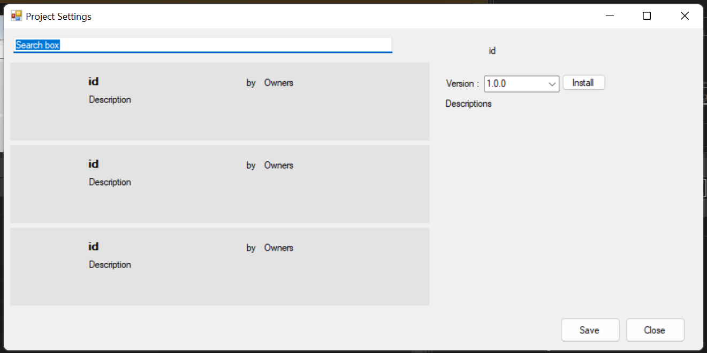

Project Settings
================

The project settings functionality enables you to download activity packages, libraries and others, view the ones already installed for your project and update them, as well as add and remove your own. It shows the list of available packages per feed and the list of dependencies per current project.

**Installing Packages**

  - Step 1: In the **Project Settings** window select the Packages category. This opens a list of all packages gathered from your **BYpass** feeds.
  - Step 2: Locate the package you want to install. You can scroll down the list to find the package or search for the package by typing part of its name in the search bar.
  - Step 3: Select an activity package to view its description, version, dependencies, the project URL and the date when it was published.
  - Step 4: Click on the drop-down list next to Version to pick a version or update Version of the package. 
  - Step 5: Click on the Install button. 
  - Step 6: Click Save to install the packages or update the versions.

