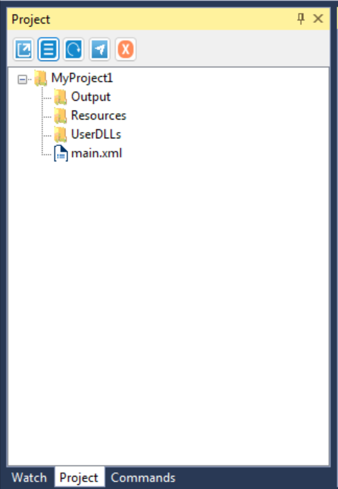

Project Window
===============

The Project panel enables you to view the contents of the current project, add folders, open the file location, manage dependencies, and adjust project settings.

Copy and paste files from File Explorer directly into the Project panel. The same can be done using drag and drop on one or multiple files, including .xml workflows. You can also use the Ctrl + C and Ctrl + V shortcuts or Copy and Paste options in the context menu to copy and duplicate files or folders inside the panel.

**Option**

- **Open project**: Opens the project's location on the machine by double-click the ".byp" file format. The project will display related files hierarchically.
- :doc:`ProjectSettings`: Opens the Project Settings window for processes or libraries.
- **Refresh**: Refreshes the project.
- **Encrypt Project**: The Encrypting Project file contains sensitive information one may want to secure. It is possible to encrypt sections in the project which can be decrypted only by Bypass robot, e.g., you have to protect sensitive information like password or personal identity, This custom command will help to encrypt such sensitive information.
- **Close Project**: Close the Project.

**See Aslo**

.. 	toctree::
	
	ProjectSettings

	

