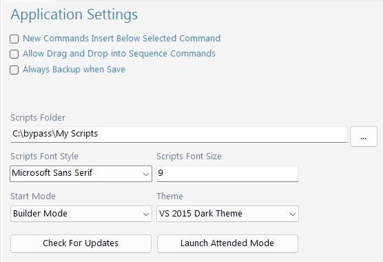

Application Settings
====================

**New Commands Insert Below Selected Command** If it does not set, the command will insert at the end of script.

**Allow Drag and Drop into Sequence Commands** This setting allows to move commands inside :doc:`commands/sequence`
	
**Always Backup on Save** This setting will create backup file every time when script is saved.
	
**Script Folder** This is the folder where the scripts are saved
	
**Font Style and Size** This setting allows to set the font style and size on the :doc:`scripteditorwindow`

**Start Mode** This setting is type of start between **Builder Mode** or :doc:`attendmode`
	
**Theme** This setting allows to change appearance of **BYpass** 
	
**Check For Updates** This setting checks for update and allow to update **BYpass** to newer version

**Launch Attended Mode** This setting opens the :doc:`attendmode`