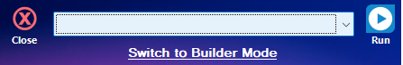

Attended Task Mode
==================

In this mode **BYpass** will display only available script from the **Scripts Folder** that set in :doc:`applicationsettings` page. In this mode, you can selete the script and click **Run** to execute the script.