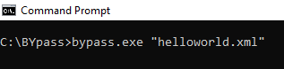

Command Line
============

**BYpass** supports execution from command line. You can execute the script in conjunction with Task Schedule in Window in order to setup the execution time. The syntax to call script is as follow.

.. code-block:: rst
   :caption: Command Line Syntax

   [Path to BYpass]\bypass.exe "[Path to Script]"

For example: 

