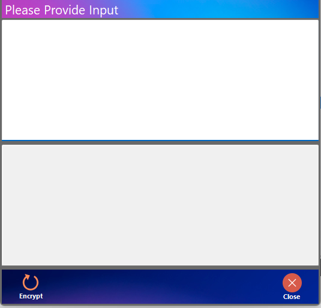

Encryption
==========

This is a tool to encrypt the sensitive data such as password. In **BYpass** you can encrypt the password and input the encrypted text into the commands such as the field **MySQL Password** of the command :doc:`Define MySQL Connection <commands/mysqlconnection>`.

In order to encrypt the password. Follow the step below

	#. Input the password in the top box
	#. Click *Encrypt*
	#. The encrypted text will display in the bottom box
	#. Copy the encrypted text 
	#. Paste to password field
	#. In the command set **Use Encrypted Password** to **Yes**
	
	.. image:: images/execute_3.png
	  :alt: Encryption	