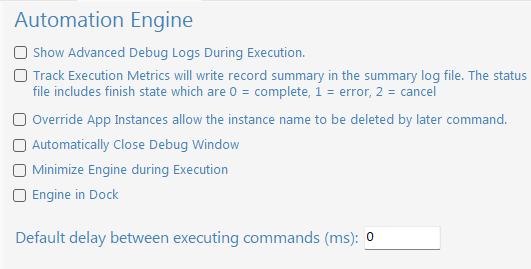

Automation Engine Settings
==========================

**Show Advanced Debug Logs During Execution** Enable this setting, **BYpass** will displays log movement during execution.

**Track Execution Matrics** Enable this setting, **BYpass** will create **Summary Logs** to keep record of each execution.

**Override App Instances** Enable this setting will allow *Application Instance* to be reused. For example, in case the **"default"** App Instance is used with Excel and later on the name **"default"** App Instance is used again with Open Browser, the **"default"** App Instance will be replaced and be used on Open Browser. If this setting is disable, **BYpass** will show error when App Instance is reused.

**Automatically Close Debug Window** Enable this setting, the :doc:`executionwindow` will automatically close after the execution is completed.

**Minimize Engine During Execution** Enable this setting will disable **Engine in Dock**. This setting will minimize the :doc:`executionwindow` during execution.

**Engine in Dock** Enable this setting will disable **Minimize Engine During Execution**. This setting will attach the :doc:`executionwindow` to the bottom window of Developer Studio.

**Default delay between executing commands** This is the number in milliseconds for **BYpass** to delay the execution for each command. 