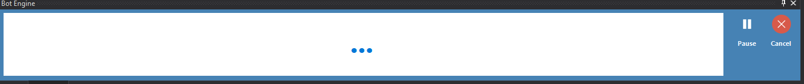
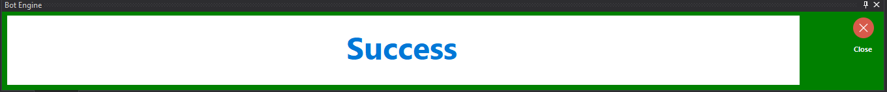
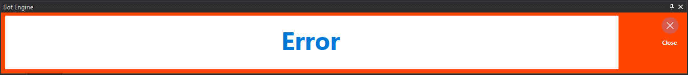

Execution Window
================

This window displays the status of execution. You can pause or stop execution from this window.

**Being Execution**

  
**Success Execution**

  
**Error Execution**

  
