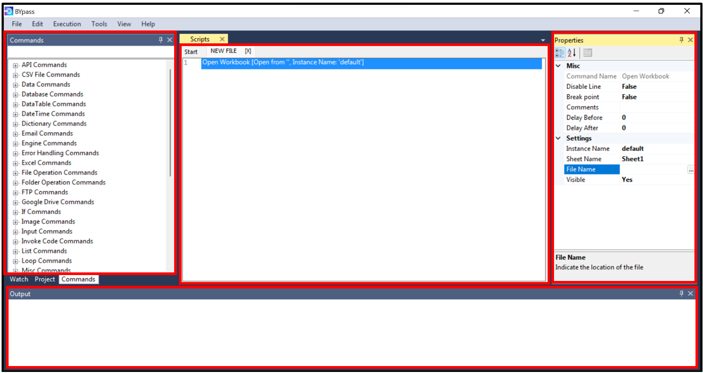

Layout
======

BYpass Developer Tool consists of four main panes

* **Left pane:** 	
	
	- The :doc:`commandswindow` is where the commands are listed
	- The :doc:`watchwindow` for deeper look during script execution
	- The :doc:`ProjectWindow` for view the contents of the current project
	
* **Middle pane:**

	- The :doc:`scripteditorwindow` for RPA flow design
	
* **Right pane:**

	- The :doc:`propertywindow` for command configuration
	
* **Bottom pane:**

	- The :doc:`outputwindow` for displaying during the script execution
	- The :doc:`executionwindow` for displaying status of script execution

