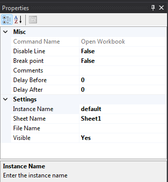

Property Window
===============

This window is where each command is configured. The window consists of property name and value input to the command to work. Ususally, this window consists of two sections. 

	**Misc** is where the common properties of all command are located. You can mark it as *Disable*, *Break point*, put some information into the *Comment* or even delay the command on both before execution or after execution.
	
	**Settings** is where properties can be configured differently depend on the function of each command.

